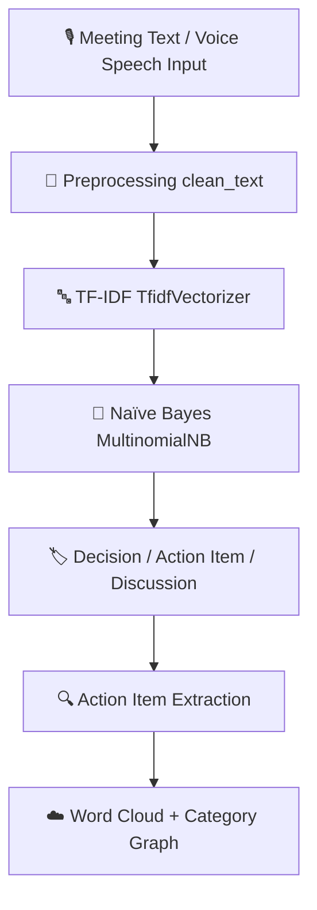

# 🎙️ IntelliMin : Voice-to-Text Meeting Minutes Automator

**IntelliMin** is an AI-powered multilingual voice-to-text meeting minutes automator built using **Streamlit**, **SQLite Database**, **Scikit-Learn (TF-IDF + Naive Bayes)**, **Groq AI (Whisper-v3 & LLM Models)**, **ReportLab**, **python-docx**, **Plotly**, and **WordCloud**.

---

## 📐 Simple Project Flowchart



---

## 🌟 Key Features & Capabilities

1. 📓 **Two Jupyter Notebooks**:
   - **`IntelliMinutes_NLP_Project.ipynb`**: Text Preprocessing, TF-IDF Vectorization, Naive Bayes Classification, Action Item Extraction, WordCloud, & Category Graph.
   - **`Audio_Speech_To_Text_Transcription.ipynb`**: Audio Recording, Media File Loading, Speech-to-Text Transcription (Whisper ASR), & Sentence Formatting.

2. ⚡ **Standalone Streamlit Codebase (`app.py`)**:
   - All backend NLP processing, audio transcription, report generation, and PDF/DOCX exporters embedded in clean, beginner-friendly code.

3. 🤖 **Trained Machine Learning Intent Model**:
   - Trains a Scikit-Learn `TfidfVectorizer` + `MultinomialNB` classifier model on meeting dataset (`meeting_dataset.csv`).

4. 📄 **Type A Professional Meeting Report Format**:
   - Every generated report strictly follows the 5 professional meeting report sections:
     1. **Document Metadata**: Header (Title, Date, Time, Location/Link), Attendance (Facilitator, Note-Taker, Attendees `Person 1` / `Person 2`, Absentees).
     2. **Executive Summary**: Core Objective and 2-3 sentence Outcome.
     3. **Discussion Points**: Agenda Topics, Key Arguments/Perspectives, Consensus/Disagreements.
     4. **Action Items & Next Steps**: Specific Deliverables, Exact Owners (`Person 1`, `Person 2`), Deadlines.
     5. **Future Planning**: Open/Tabled Issues, Next Meeting Schedule.

5. 📥 **PDF & DOCX Export with Download Date Stamp**:
   - Download reports directly as native **PDF (`.pdf`)** or **Word Document (`.docx`)** with download date automatically stamped.

6. 🎙️ **Workable Live Voice Recording & Fresh Session Reset**:
   - Live microphone recording with speech-to-text transcription.
   - Dynamic widget keying ensures every new recording or upload resets state completely with zero residual speech.

7. 📁 **Audio & Video File Upload**:
   - Drag-and-drop support for audio files (`.mp3`, `.wav`, `.m4a`, `.ogg`, `.flac`) AND video files (`.mp4`, `.avi`, `.mov`, `.mkv`).

8. 🔒 **Secure GitHub Deployment Ready**:
   - Secret Groq API keys are decoupled into `.env` / Streamlit Secrets. `.gitignore` prevents exposing sensitive credentials or databases on public repositories.

---

## 📁 Project Structure

```
Capstone-NLP/
├── app.py                                   # Beginner-Friendly Web Application Code
├── style.css                                # Master CSS Stylesheet
├── header.html                              # Separate Header Template
├── IntelliMinutes_NLP_Project.ipynb         # Notebook 1: NLP Text Model & Classifier
├── Audio_Speech_To_Text_Transcription.ipynb # Notebook 2: Audio Speech-to-Text Transcriber
├── meeting_dataset.csv                      # Dataset Extracted from archive (1).zip
├── requirements.txt                         # Python Package Dependencies
├── .env.example                             # Environment Variables Template
├── .gitignore                               # Excludes Secrets & DB from Git
└── README.md                                # Project Documentation
```

---

## 🚀 Quick Start & Environment Setup

### 1. Install Dependencies
```bash
pip install -r requirements.txt
```

### 2. Configure Environment Secrets
Create a `.env` file in the root directory (or copy from `.env.example`):
```env
GROQ_API_KEY=your_actual_groq_api_key_here
```

### 3. Run the Streamlit Application
```bash
streamlit run app.py
```
Open `http://localhost:8501` in your browser.

Open deployed project in Website 
```bash
https://intellimin-voice-to-text-meeting-minutes-automator-kvkgd4rcwbi.streamlit.app/
```
